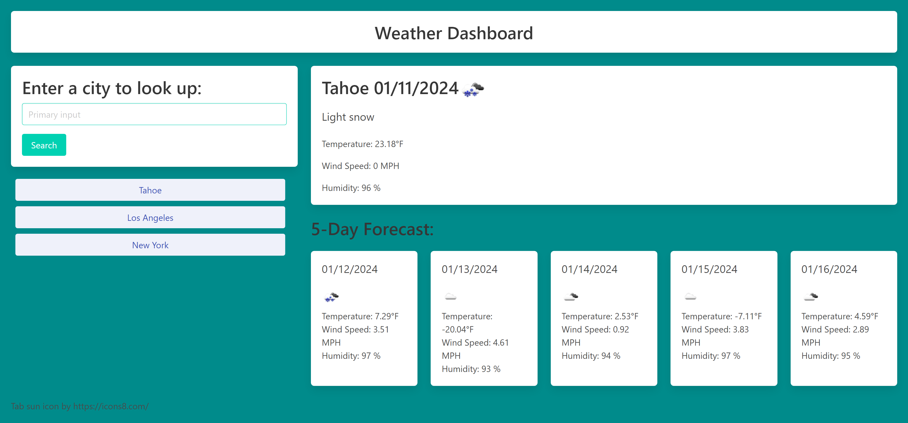

# Weather Dashboard App

## Description

This project is a weather dashboard. Used OpenWeather API and Bulma CSS library.

## Installation

N/A

## Usage

When the page first loads, the current weather conditions for Tahoe will display for the day. There will also be a forecast for the next 5 days. There is a search bar where you can input a different city's weather to look up. As the city is searched it is added to the local storage as a history of cities that you can easily search for again. Each section displays the City name, date, temperature, wind speed, humidity, and and icon representation of the weather. 

Deployed project:
https://arisof.github.io/weather-app/

Screenshot:

## Credits

Sofia Villalpando

## License

MIT License
